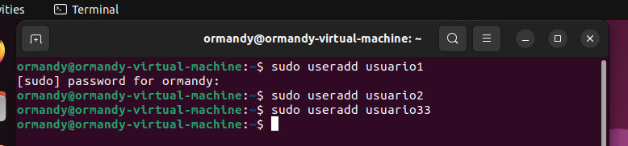
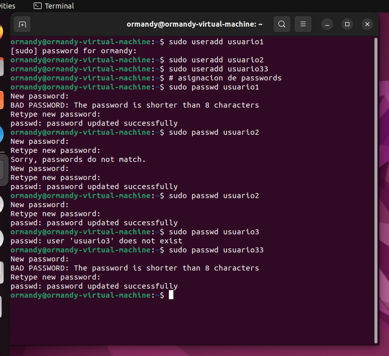
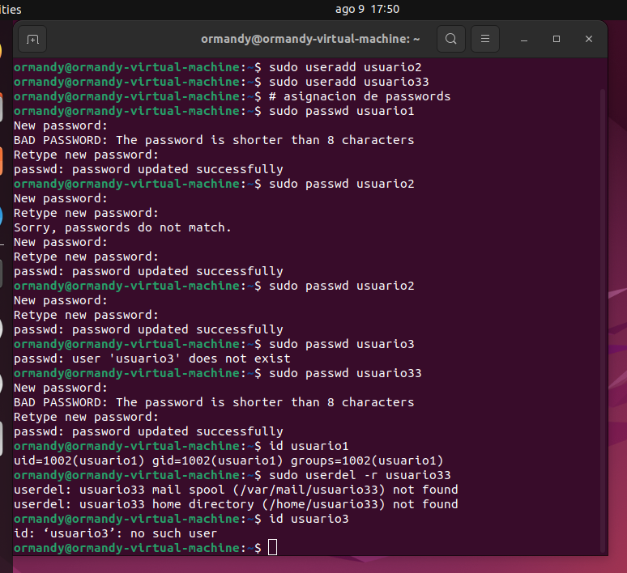
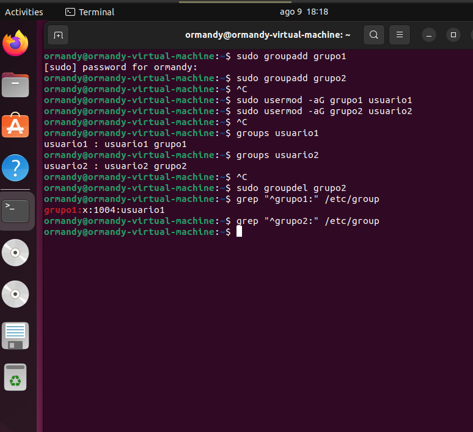
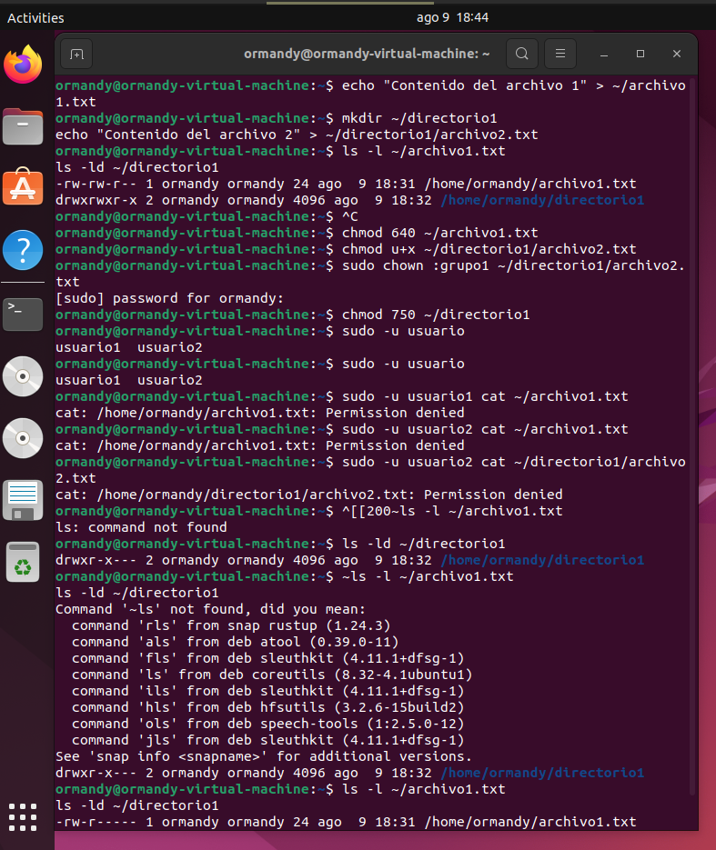

# Detalles

**Objetivo:** Familiarizar a los estudiantes con la administración de usuarios, grupos y permisos en un sistema operativo Linux.

**Requisitos previos:** Tener instalado un sistema Linux y acceso al terminal.

**Envío:** Enviar enlace al folder `actividad3` de su repositorio de GitHub.

## Instrucciones

Crear un archivo MD y resolver cada uno de los ítems solicitados a continuación. Debe colocar el comando utilizado así como el resultado de este si es necesario.

### Parte 1: Gestión de Usuarios

1. **Creación de Usuarios:** Crea tres usuarios llamados `usuario1`, `usuario2` y `usuario3`.
    Comando para crear usuario1

    ``` Bash 
    sudo useradd usuario1
    ```

    Al utilizar el comando sudo por primera vez nos pedira el password
    
    
    Para la creacion de los otros usuarios no nos los pedira, al menos que pase un tiempo muy prolongado para crear el siguiente usuario.

    


2. **Asignación de Contraseñas:** Establece nuevas contraseñas para cada usuario creado.
    Comando para crear contraseñas

    ``` Bash
    sudo passwd usuario 1
    ```

    

    Como podemos observar si colocamos una contraseña de baja seguridad nos dara un mensaje de advertencia.

3. **Información de Usuarios:** Muestra la información de `usuario1` usando el comando `id`.
    Comando
    ``` Bash 
    ormandy@ormandy:~$ id usuario1 
    uid=1002(usuario1) gid=1002(usuario1) groups=1002(usuario1)
    ```

4. **Eliminación de Usuarios:** Elimina `usuario3`, pero conserva su directorio principal.
    Comando
    ``` Bash
    ormandy@ormandy:~$ sudo userdel -r usuario33

    ```

    Salida 
    ``` Bash
    userdel: usuario33 mail spool (/var/mail/usuario33) not found
    userdel: usuario33 home directory (/home/usuario33) not found 
    ```

### Parte 2: Gestión de Grupos

1. **Creación de Grupos:** Crea dos grupos llamados `grupo1` y `grupo2`.

    ``` Bash
    ormandy@ormandy:~$ sudo groupadd grupo1
    [sudo] password for ormandy: 
    ormandy@ormandy:~$ sudo groupadd grupo2
    ormandy@ormandy:~$ 
    ```

2. **Agregar Usuarios a Grupos:** Agrega `usuario1` a `grupo1` y `usuario2` a `grupo2`.
    Comandos
    ``` Bash
    ormandy@ormandy:~$ sudo usermod -aG grupo1 usuario1
    ormandy@ormandy:~$ sudo usermod -aG grupo2 usuario2

    ```
    El flag -aG agrega al usuario al grupo especificado sin eliminarlos de otros grupos.

3. **Verificar Membresía:** Verifica que los usuarios han sido agregados a los grupos utilizando el comando `groups`.
    Comandos
    ``` Bash
    ormandy@ormandy:~$ groups usuario1
    usuario1 : usuario1 grupo1
    ormandy@ormandy:~$ groups usuario2
    usuario2 : usuario2 grupo2
    ormandy@ormandy:~$ 
    ```
    Esto mostrará los grupos a los que pertenecen los usuarios.


4. **Eliminar Grupo:** Elimina `grupo2`.
    Comando
    ``` Bash
    ormandy@ormandy:~$ sudo groupdel grupo2
    ormandy@ormandy:~$ grep "^grupo2:" /etc/group
    ormandy@ormandy:~$ 

    ```
    Elimnacion y verificacion de eliminacion del grupo

    


### Parte 3: Gestión de Permisos

1. **Creación de Archivos y Directorios:**

   - Como `usuario1`, crea un archivo llamado `archivo1.txt` en su directorio principal y escribe algo en él.
    ``` Bash
    echo "Contenido del archivo 1" > ~/archivo1.txt

    ```
   - Crea un directorio llamado `directorio1` y dentro de ese directorio, un archivo llamado `archivo2.txt`.

   ``` Bash
    mkdir ~/directorio1
    echo "Contenido del archivo 2" > ~/directorio1/archivo2.txt
   
   ```
   

2. **Verificar Permisos:** Verifica los permisos del archivo y directorio usando el comando `ls -l` y `ls -ld` respectivamente.

    ``` Bash
    ormandy@ormandy:~$ sudo -u usuario1 ls -l ~/archivo1.txt
    ls -ld ~/directorio1
    -rw-rw-r-- 1 ormandy ormandy 24 ago  9 18:31 /home/ormandy/archivo1.txt
    drwxrwxr-x 2 ormandy ormandy 4096 ago  9 18:32 /home/ormandy/directorio1
    ormandy@ormandy:~$ 
    ```

3. **Modificar Permisos usando `chmod` con Modo Numérico:** Cambia los permisos del `archivo1.txt` para que sólo `usuario1` pueda leer y escribir (permisos `rw-`), el grupo pueda leer (permisos `r--`) y nadie más pueda hacer nada.

    ``` Bash
    sudo -u usuario1 chmod 640 ~/archivo1.txt
    ```

4. **Modificar Permisos usando `chmod` con Modo Simbólico:** Agrega permiso de ejecución al propietario del `archivo2.txt`.
    ``` Bash
    sudo -u usuario1 chmod u+x ~/directorio1/archivo2.txt

    ```

5. **Cambiar el Grupo Propietario:** Cambia el grupo propietario de `archivo2.txt` a `grupo1`.
    ``` Bash
    sudo -u usuario1 chown :grupo1 ~/directorio1/archivo2.txt

    ```

6. **Configurar Permisos de Directorio:** Cambia los permisos del `directorio1` para que sólo el propietario pueda entrar (permisos `rwx`), el grupo pueda listar contenidos pero no entrar (permisos `r--`), y otros no puedan hacer nada.

    ``` Bash
    sudo -u usuario1 chmod 750 ~/directorio1

    ```

7. **Comprobación de Acceso:** Intenta acceder al `archivo1.txt` y `directorio1/archivo2.txt` como `usuario2`. Nota cómo el permiso de directorio afecta el acceso a los archivos dentro de él.

    ``` Bash
    sudo -u usuario2 cat ~/archivo1.txt       # Intenta leer archivo1.txt
    sudo -u usuario2 cat ~/directorio1/archivo2.txt   # Intenta leer archivo2.txt

    ```

8. **Verificación Final:** Verifica los permisos y propietario de los archivos y directorio nuevamente con `ls -l` y `ls -ld`.

    ```Bash
    ls -l ~/archivo1.txt
    ls -ld ~/directorio1

    ```

### Reflexión: (Opcional)

Contestar las siguientes preguntas:

- ¿Por qué es importante gestionar correctamente los usuarios y permisos en un sistema operativo?
    Para administrar la informacion ya sea de una empresa o de nuestra computadora personal.

- ¿Qué otros comandos o técnicas conocen para gestionar permisos en Linux?
    He usado chmod y chown he investigue los siguiente :
    chgrp: El comando chgrp permite cambiar el grupo propietario de un archivo o directorio. Ejemplo:

    Cambiar el grupo propietario: sudo chgrp nuevo_grupo archivo.txt
    
    umask: El comando umask define los permisos predeterminados para nuevos archivos y directorios creados por el usuario. Controla qué permisos se quitarán de los permisos completos. Ejemplo:

    Establecer una máscara de umask: umask 022 (esto permite permisos de lectura y escritura al propietario y solo lectura a grupo y otros).
